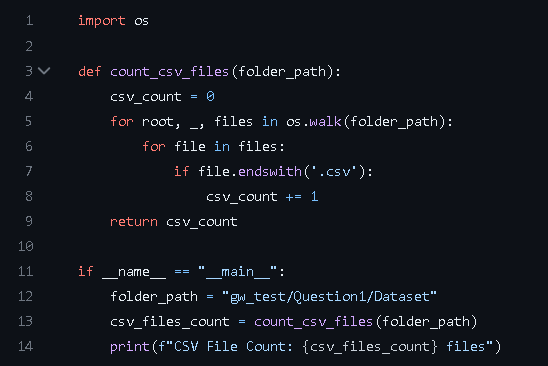
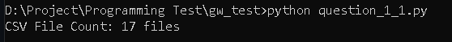
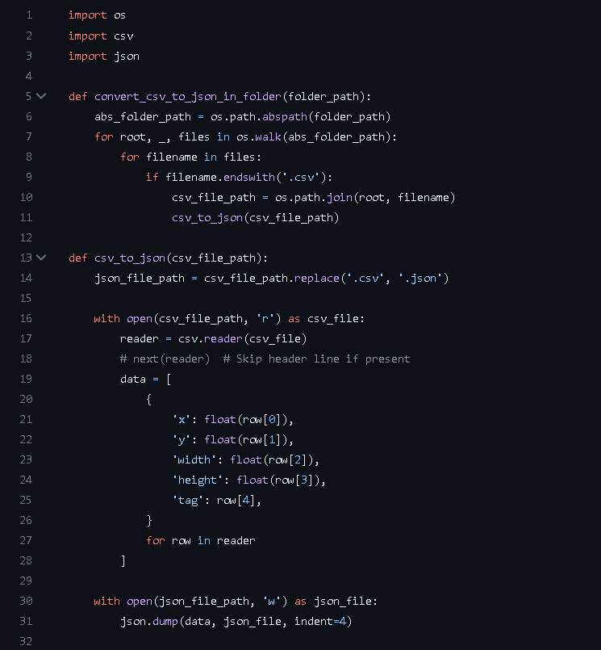
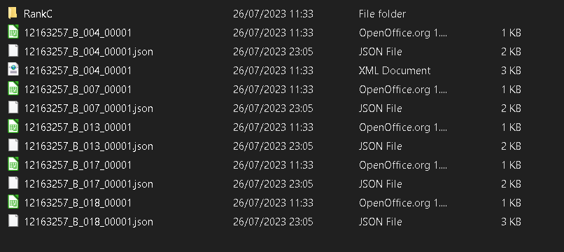
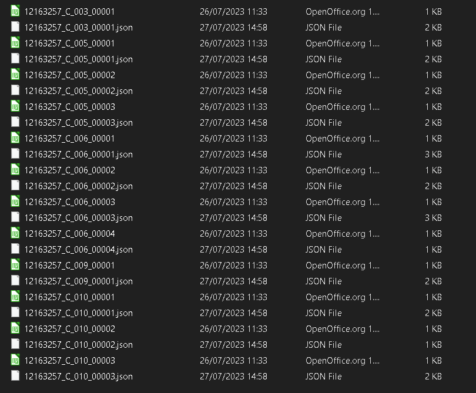
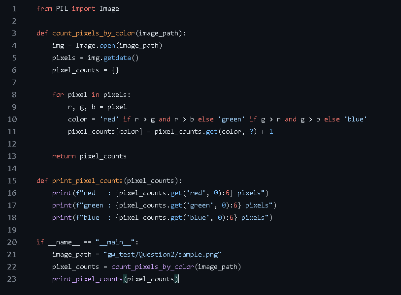
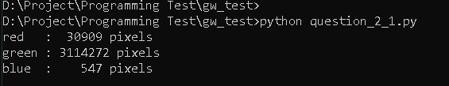

# ProgrammingTest

## Question_1_1.

---

1. The "count_csv_files" Function takes "folder_path" as an input argument. It uses the "os.walk" method to traverse the folder structure starting from the "folder_path".

"for root, _, files in os.walk(folder_path):" generates 3 tuples of iterations.

      > 1. root      - The current directory being visited.
	  > 2. dirs      - This value is not used in the for loop. Therefore, '_' is used to discard it.
	  > 3. files     - The list of files in the current directory.

"if file.endswith('.csv'):"

	Within the for loop, this conditional statement is used to check whether the current file ends with the string '.csv'. 

"if __name__ == "__main__":"

	A common Python construct that allows you to control the execution of code when a Python script is run as the main program.

---
### The output is:

---
## Question_1_2.

---

### 1. " convert_csv_to_json_in_folder(folder_path)" function.
- Absolute File path is used for subdirectory in "Dataset" which is "RankC".	
Using an absolute file path provides the full and unambiguous location of a file or directory in the file system. Unlike a relative file path, which is dependent on the script's current working directory, an absolute file path always points to the same location, regardless of where the script is executed from. This ensures that the script can reliably access the required files even if it's moved to a different directory or run from a different location. If I use Relative file path and, if the script is executed from a different location, the relative path might point to a different directory, leading to FileNotFoundError if the files are not found in that location

- " csv_file_path = os.path.join(root, filename) " 
	"os.path.join" concatenate the "root/current" directory "filename" together to form an absolute file path. This file path is assigns to the variable "csv_file_path".

- And then, "csv_to_json(csv_file_path)" function is called.

### 2. " csv_to_json(csv_file_path) " function.

- This function will use "replace" method to convert .csv to .json extension.

		"with" statement	-	A context manager to automatically close the file after the code is executed.
		"reader" object		-	It allows to iterate over the rows of the CSV file easily.
		"data = [---]"		-	It creates a list of dictionaries (data) where each dictionary represents a row in the CSV file. The keys are 'x', 'y', 'width', 'height', and 'tag'. Values are obtained by converting the elements in each row to float and using the original string values. 	

- And then, contents of the data list is written in json format.

---

### 3. Result:

---

---

## Question_1_3

## Question_2_1
---
.
---
### "count_pixels_by_color" function:
- Image.open(image_path)	=	This method creates an 'Image' object from the image file path.
- getdata() 		=	This method returns a sequence containing pixel values.
- An empty dictionary "pixel_counts" is created to store the counts of each color. 
- Then, sequence of pixel data are looped and place in the r, g, b variables and determine color based on the intensity of pixel.
- At the end of the function, dictionary is updated and pixel counts are returned.

### Output:
---
.
---
