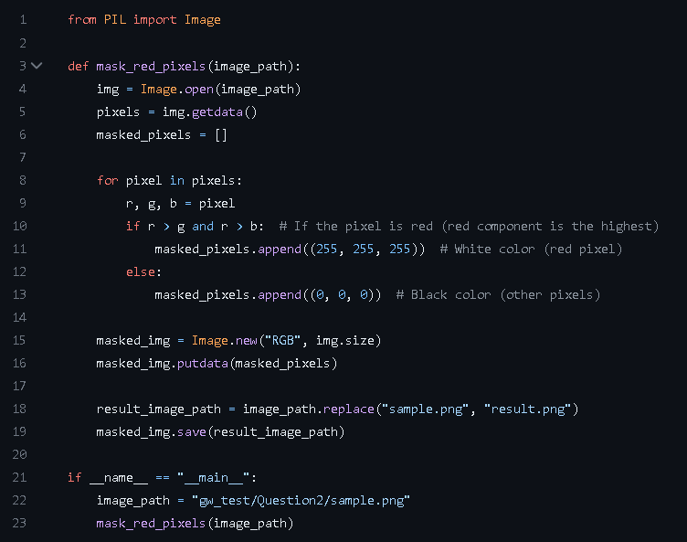
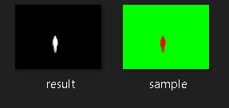
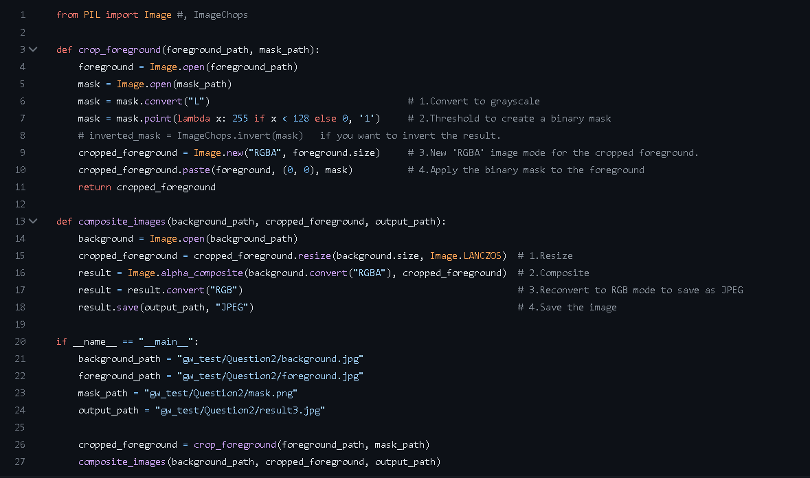
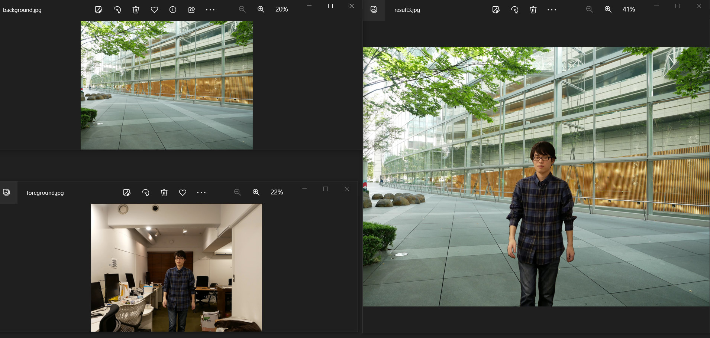
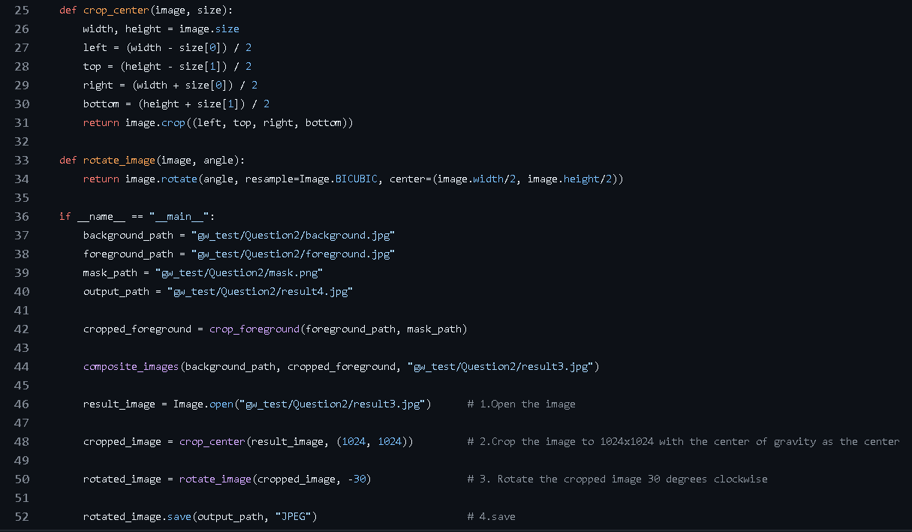
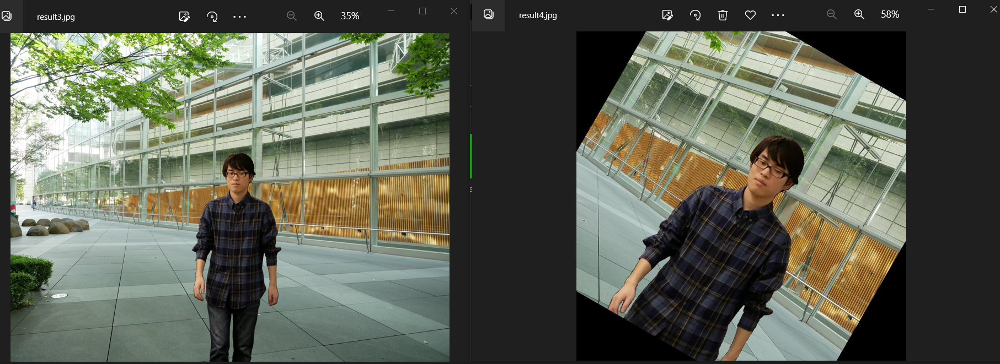

# ProgrammingTest

# Question_1_1.

---

1. The "count_csv_files" Function takes "folder_path" as an input argument. It uses the "os.walk" method to traverse the folder structure starting from the "folder_path".

"for root, _, files in os.walk(folder_path):" generates 3 tuples of iterations.

      > 1. root      - The current directory being visited.
	  > 2. dirs      - This value is not used in the for loop. Therefore, '_' is used to discard it.
	  > 3. files     - The list of files in the current directory.

"if file.endswith('.csv'):"

	Within the for loop, this conditional statement is used to check whether the current file ends with the string '.csv'. 

"if __name__ == "__main__":"

	A common Python construct that allows you to control the execution of code when a Python script is run as the main program.

---
### The output is:

---
# Question_1_2.

---

### 1. " convert_csv_to_json_in_folder(folder_path)" function.
> Absolute File path is used for subdirectory in "Dataset" which is "RankC".	
Using an absolute file path provides the full and unambiguous location of a file or directory in the file system. Unlike a relative file path, which is dependent on the script's current working directory, an absolute file path always points to the same location, regardless of where the script is executed from. This ensures that the script can reliably access the required files even if it's moved to a different directory or run from a different location. If I use Relative file path and, if the script is executed from a different location, the relative path might point to a different directory, leading to FileNotFoundError if the files are not found in that location

> " csv_file_path = os.path.join(root, filename) " 
	"os.path.join" concatenate the "root/current" directory "filename" together to form an absolute file path. This file path is assigns to the variable "csv_file_path".

> And then, "csv_to_json(csv_file_path)" function is called.

### 2. " csv_to_json(csv_file_path) " function.

> This function will use "replace" method to convert .csv to .json extension.

		"with" statement	-	A context manager to automatically close the file after the code is executed.
		"reader" object		-	It allows to iterate over the rows of the CSV file easily.
		"data = [---]"		-	It creates a list of dictionaries (data) where each dictionary represents a row in the CSV file. The keys are 'x', 'y', 'width', 'height', and 'tag'. Values are obtained by converting the elements in each row to float and using the original string values. 	

> And then, contents of the data list is written in json format.

---

### 3. Result:

---

---

# Question_1_3

# Question_2_1
---
.
---
### "count_pixels_by_color" function:
> Image.open(image_path)	=	This method creates an 'Image' object from the image file path.
> getdata() 		=	This method returns a sequence containing pixel values.
> An empty dictionary "pixel_counts" is created to store the counts of each color. 
> Then, sequence of pixel data are looped and place in the r, g, b variables and determine color based on the intensity of pixel.
> At the end of the function, dictionary is updated and pixel counts are returned.

### Output:
---
.

---
#  Question_2_2
---
.
---
## Result
---
.
---

# Question_2_3

---
.
---

### "crop_foreground" function:
> 1. **Convert to grayscale:** 	Mask image is converted to grayscale because grayscale images have only one channel (representing luminance), which is essential to simplify the process of thresholding later.
> 2. **Threshold to create binary mask:**  	The "point()" method maps the image's pixel values through a lambda function. If the pixel value is less than 128, it is set to 255 (white or the region of interest); otherwise, it is set to 0 (black). {Note: Red color has pixel values less than 128 and the green color has pixel values greater than or equal to 128. Therefore red color is assumed as an interested region ( as the question needed). The green color will be transparent in the "cropped_foreground".}
> 3. **New 'RGBA' image mode:** 	"RGBA" mode indicates that the image will have four channels: red, green, blue, and alpha (transparency). The alpha channel allows us to control which parts of the foreground image will be fully opaque (visible) and which parts will be fully transparent (invisible) based on the binary mask's white and black regions. Then, the size argument specifies the size of the new image to be the same dimensions as the foreground image.
> 4. **Apply the binary mask to the foreground:** This "paste()" method is responsible for pasting the relevant part of the foreground image onto the cropped_foreground using the binary mask as a transparency mask. This operation performs the actual cropping of the foreground image.
> 5. **Returned result:** After the cropping process is completed, the cropped_foreground will contain only the part of the original foreground image that corresponds to the region of interest defined by the binary mask, and the rest of the image will be transparent, allowing for easy compositing with other images or backgrounds.
---
### "composite_images" function:
> 1. __Resize:__ First, I need to resize the "cropped_foreground" image to match the size of the "background" image. I also used the resize() method with the Image.LANCZOS resampling filter, which provides good quality when resizing images.
> 2. **Composite:** This line creates the final composite image by pasting the resized cropped_foreground onto the background. To do this, both images are converted to the "RGBA" mode to ensure they have an alpha channel (transparency). Then, the alpha_composite() method is used to composite the images based on their alpha channels. The alpha_composite() method preserves the transparency of both images while combining them.
> 3. **Reconvert to RGB mode:** JPEG does not support an alpha channel.
> 4. **Save the image:** ( Please check the output image in the following! )

---
.
---

# Question_2_4.

---
.
---

### crop_center function:
> To keep the center of the original image at the center of the cropped region, the provided formula is used. Then, the image.crop method is used to create a new image that represents the cropped region.

### rotate_image function:
> The "image.rotate" method is used to perform the rotation. The center of rotation is specified as (W/2, H/2), which represents the coordinates of the center of the image. By using "Image.BICUBIC" as the resampling method during image rotation, the "image.rotate" method produces more visually pleasing and accurate results, especially when resizing and rotating images with complex patterns or fine details.

### Main steps
> 1. Open the "result3.jpb".
> 2. Input the image with 1024x1024 size.
> 3. Rotate the cropped image 30 degrees clockwise(-30).
> 4. Save the image.

### Result:
---
.
---
